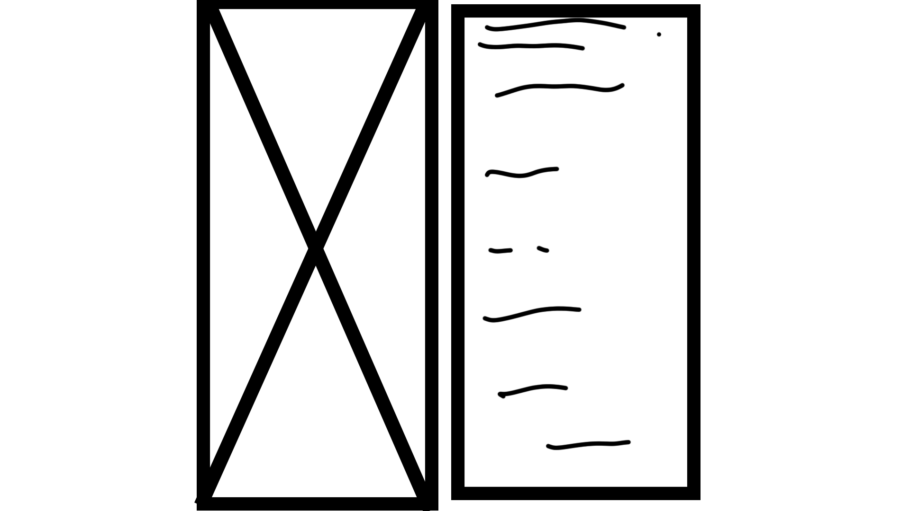

# Dating using Machine Learning

# Introduction

This is a concept website for online dating using AI.  The concept is to have an unbiased experience by matching users using machine learning.

In traditional online dating, users generally specify a range of criteria they are looking for such as age, location, gender, interests and so on.  They are then presented with random profiles which fall within their selection scope.

While this approach may be feasible, users may have to swipe through many hundreds of profiles to find a potential selection to try and match with.  This is very time consuming.

The approach I am taking is different and is based on the belief that each person already subconsciously knows what type of person their ideal partner is.

So a person already knows and imagines how their ideal partner looks and acts, even before meeting, or knowing them.  Most people are familiar with the phrase "Love at first sight".

The idea is to use and exploit the capabilities of machine learning to extract the model of the ideal person for each user and find matches based on that.

In this readme I am not defining the methods or mathematics that I would use as this would not be made available publicly.

Therefore this readme is restricted to the frontend design of such a website.

I have designed the website to look visually appealing and informative, to try to make a user feel like they want to sign up.

I have deliberately chosen a simple minimal style as I believe this conveys the purpose of the website to the user efficiently.

Here is the link to the live site.  https://rod-vadar.github.io/assignment1/index.html

# **Wireframe**
For the wireframe I used photoshop to create a placeholder layout for images and text.

## Header ##

## Features ##

## Pricing ##

## Discover ##

## Footer ##

## Sign up page ##

### **Color Space**
The color space is based on a minimalist color space which suits the design of looking like the cover of a stylish magazine. I prefer to understate text intensity and keep it balanced with the images.
I chose the colors of red #DC3545, white #FFFFFF, black #000000 and gray shades.

Color contrast ratio

Font style
I did some experiments using Lato and Roboto from google fonts.  I ended up removing these as I actually prefer the bootstrap font style.

### **User Experience**

Primary purpose
The primary purpose of the landing page is to seduce the user to sign up for a premium account.

First time user
A first time user is immediately exposed to visuals and buttons to join.  This is repeated several times throughout the landing page.

Regular user
For the regular user who is already a member of the site, the user is immediately available to login at the top of the site.

Creation process

### **Strategy**
I designed the website to be immediately understood by the user.
It is accessible by mobile and desktop browsers.
The website is simple and easy to navigate as it is displayed as a single page, with the exception of the signup / login page.
The pricing is clear and unambiguous.

### **Scope**
The website is accessible to users aged 18+ up.
I used the benefits of bootstrap to provide the perfect experience for all users and devices.

### **Structural**
The navigation links are fixed to the top of the screen on desktop.  On mobile they are accessible from the burger menu.
The buttons maintain their purpose consistently throughout the site and are easily accessible.
The footer is clear and links to social media pages.

### **Skeleton**
Essentially a single page application.
Links scroll to the selected section of the page.

Header section contains a logo, nav links, and signup / login links.

Navigation links are Home, Features, Pricing, Discover. These scroll the page to the sections.
Some of the images are only available on desktop browsers.
Some text is also available on desktop browsers.
The text is removed or altered for mobile devices to make it easier to navigate and maintain the feel and style of the website.
The features section contains an image and some text suggesting the AI features of the site.  It also contains a button to sign up essentially using the text "Start your love story".
The pricing section contains 3 premium prices for monthly, three monthly and annual options.  The signup button is again presented three times to reinforce the message to for the user to sign up.
The discover section contains an image and accordion style questions which a new user to the site might have.  The user is able to click and reveal the answers.
The final section is the footer which contains external links to common social media.  It also contains the website nav links.

The only other page is the actual sign up page.  This contains an image and a sign up form.

### **Wireframe**
For the wireframe I simply used pen and paper to sketch a rough outline and then used photoshop to make a simple placeholder layout for images and text.

### **Images**
I downloaded all images from the website www.pexels.com.  These are royalty free. I spent many hours searching thousands of images to choose the correct ones.  I chose images which I feel are pleasing to the user and really help to sell the website and get people to sign up.

### **Typography**
I am very happy with the style of the typography which comes with bootstrap.  I feel it works and is stylish.  I also like the lower intensity of some of the text paragraphs.  I want intensity ripples throughout as I feel this is a little like musicial sections which wax and wane in tempo and feel.

# Mobile Design

I designed the whole website in small modules and I use bootstrap 'container-row-column' states to control responsive layout.

This allows me to finely control the display or removal of modular features depending on the device.
For example I am able to write two different text states.
If the user is on a mobile device the mobile state will show but not the desktop state.
The reverse is also true.

By adopting this approach I am able to keep css to a minimum.

# Site Map

# Code Validation

I used https://validator.w3.org/ to validate all code and css.
html validation

css validation

# Bugs

On the mobile device the burger menu displays too large.  I am unsure how to resolve this and I am continuing to seek a solution.

# Performance

I used lighthouse and tinypng.com to optimize performance of image compression.

# Page Deployment

# Page Highlights

## Logo and Headline

## Tagline and call to action buttons

## Call to action reinforcement

# Future Implementation

I would like to actually implement this as a working website.  The steps involved in this would require more pages for user profiles, the ability to upload image files and user data.  I would probably use  <a href="https://firebase.google.com/" target="_blank">Google Firebase</a> 0r similar for such an application.

I would also have to run AI services in the background to process user images and data.

I do feel that this is feasible and achieveable. Google firebase offers machine learning tools website use.

If this website was built it would require a considerable amount of investment for a massive advertising blitz campaign.

It would need to attract an enormous amount of of users very rapidly to ensure that there are enough users for the service to be of use and interest to singles.

<a href="https://firebase.google.com/" target="_blank">Google Firebase</a> would be suitable for this as it can spin up new servers very quickly and handle large amount of simultaneous requests.

